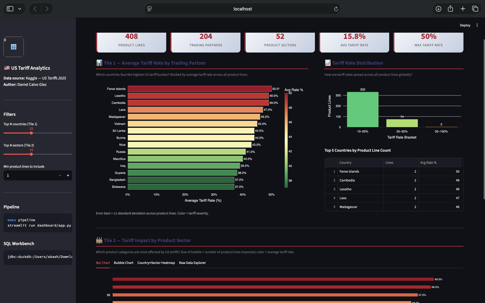
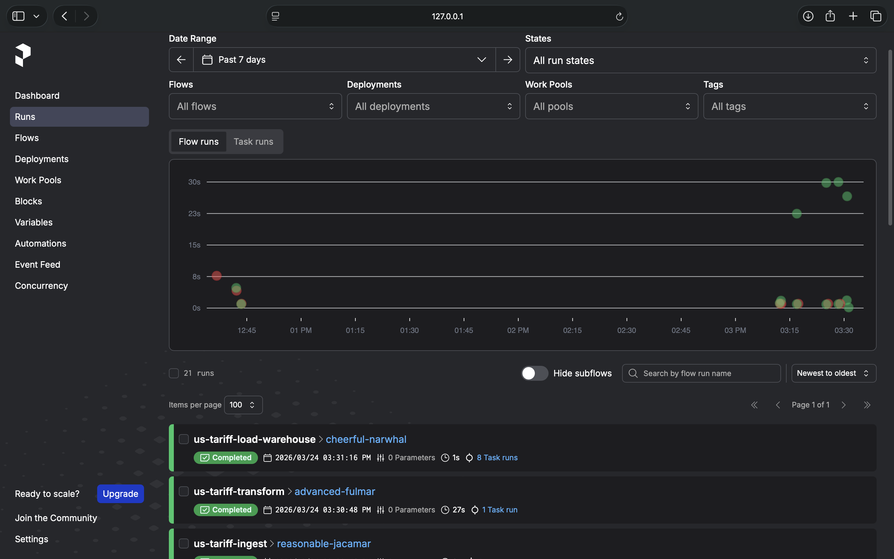

#  US Tariff Analytics Dashboard

An end-to-end data pipeline and analytics dashboard for exploring US Tariffs (2025) data — built entirely locally with no cloud account required.


##  Problem Description

The United States has implemented a sweeping set of tariffs in 2025, affecting trade relationships with dozens of countries across hundreds of product categories. Understanding which countries face the highest tariff rates, which product sectors are most impacted, and how tariff burdens are distributed is critical for businesses, economists, and policy analysts.

This project builds a fully automated local data pipeline that:
- **Ingests** raw US tariff data from Kaggle
- **Stores** it in a local data lake (Parquet format)
- **Transforms** it using PySpark into analytics-ready tables
- **Loads** the results into DuckDB (a free, embedded SQL data warehouse)
- **Visualizes** it via a Streamlit dashboard with two analytical tiles

---

## Architecture

```
┌─────────────────┐    ┌──────────────────────┐    ┌─────────────────────┐
│   Kaggle API    │───▶│  Data Lake (Parquet)  │───▶│  PySpark Transform  │
│  (Raw Source)   │    │  data_lake/raw/       │    │  transformations/   │
└─────────────────┘    └──────────────────────┘    └─────────────────────┘
                                                               │
                                                               ▼
┌─────────────────┐    ┌──────────────────────┐    ┌─────────────────────┐
│   Streamlit     │◀───│   DuckDB Warehouse   │◀───│  Processed Parquet  │
│   Dashboard     │    │  warehouse/tariffs.db │    │  data_lake/processed│
└─────────────────┘    └──────────────────────┘    └─────────────────────┘
                                        ▲
                              ┌─────────────────┐
                              │  Prefect Flows  │
                              │  (Orchestration) │
                              └─────────────────┘
```

### Technology Choices

| Layer | Tool | Why |
|---|---|---|
| Orchestration | **Prefect** | Free, runs locally, beautiful UI, simple DAG definition |
| Data Lake | **Local Parquet** | Simulates cloud object storage (S3/GCS), columnar & efficient |
| Warehouse | **DuckDB** | Free embedded SQL engine, JDBC-compatible with SQL Workbench |
| Transforms | **PySpark** | Industry-standard batch processing, handles large datasets |
| Dashboard | **Streamlit** | Pure Python, fast to build, shareable |

---

##  Project Structure

```
us-tariff-analytics/
├── README.md
├── requirements.txt
├── Makefile                          # One-command shortcuts
├── pipeline/
│   ├── ingest.py                     # Prefect flow: Kaggle → Data Lake
│   ├── transform.py                  # Prefect flow: PySpark transformations
│   ├── load_warehouse.py             # Prefect flow: Parquet → DuckDB
│   └── run_pipeline.py               # Master orchestrator (runs all flows)
├── transformations/
│   └── spark_transforms.py           # PySpark transformation logic
├── warehouse/
│   └── schema.sql                    # DuckDB table definitions (partitioned)
├── dashboard/
│   └── app.py                        # Streamlit dashboard (2 tiles)
├── tests/
│   ├── test_ingest.py
│   ├── test_transforms.py
│   └── test_warehouse.py
├── data_lake/
│   ├── raw/                          # Raw CSVs from Kaggle
│   └── processed/                    # Transformed Parquet files
└── .github/
    └── workflows/
        └── ci.yml                    # CI pipeline (optional)
```

---

##  Prerequisites

- **Python 3.9+**
- **Java 8 or 11** (required for PySpark) — check with `java -version`
- **Kaggle account** (free) with API key

> **No cloud account needed.** Everything runs locally.

---

##  Quick Start

### 1. Clone the repository

```bash
git clone https://github.com/YOUR_USERNAME/us-tariff-analytics.git
cd us-tariff-analytics
```

### 2. Create and activate a virtual environment

```bash
python -m venv venv
source venv/bin/activate        # Mac/Linux
# venv\Scripts\activate         # Windows
```

### 3. Install dependencies

```bash
pip install -r requirements.txt
```

### 4. Set up Kaggle credentials

1. Go to https://www.kaggle.com → Account → Create API Token
2. This downloads `kaggle.json`
3. Place it at `~/.kaggle/kaggle.json`

```bash
mkdir -p ~/.kaggle
mv ~/Downloads/kaggle.json ~/.kaggle/kaggle.json
chmod 600 ~/.kaggle/kaggle.json
```

### 5. Run the full pipeline (one command)

```bash
make pipeline
```

Or step by step:

```bash
python pipeline/run_pipeline.py
```

### 6. Launch the dashboard

```bash
make dashboard
# or
streamlit run dashboard/app.py
```

Open your browser at **http://localhost:8501**

---

##  Connecting DuckDB to DBeaver

DuckDB has a JDBC driver, so you can query it directly in DBeaver

   DBeaver + DuckDB setup (very easy):

   Open DBeaver
   Click New Database Connection (plug icon top left)
   Search for DuckDB — it's built in!
   Set the path to your database file:
   New Connection:
   - URL: `jdbc:duckdb:/absolute/path/to/warehouse/tariffs.db`
   - No username/password needed

---

##  Dashboard Tiles

### Tile 1 — Tariff Rate by Country (Categorical Distribution)
Bar chart showing average tariff rates imposed on each trading partner. Helps identify which countries face the steepest tariff burden.

### Tile 2 — Tariff Rate Distribution by Product Sector (Temporal/Categorical)
Heatmap + bar chart showing how tariff rates vary across product categories, revealing which sectors (e.g., Steel, Electronics, Agriculture) are most heavily targeted.

---

## Running Tests

```bash
make test
# or
pytest tests/ -v
```

---

##  Prefect Orchestration UI

To monitor pipeline runs:

```bash
prefect server start
```

Then open **http://localhost:4200** in your browser.

---

##  Makefile Commands

| Command | Description |
|---|---|
| `make pipeline` | Run full ingestion → transform → load pipeline |
| `make dashboard` | Launch Streamlit dashboard |
| `make test` | Run all tests |
| `make clean` | Delete generated data files |
| `make prefect-ui` | Start Prefect local server |

---

## Data Warehouse Design

DuckDB tables are designed with query performance in mind:

- **`raw_tariffs`** — Exact copy of source data, no modifications
- **`tariffs_by_country`** — Aggregated view: avg/min/max tariff per country, sorted for fast lookup
- **`tariffs_by_sector`** — Aggregated view: rate distribution per product category
- **`tariff_summary`** — Summary statistics for dashboard KPI tiles

DuckDB automatically handles columnar storage and parallel query execution — equivalent to BigQuery's clustering for local workloads.

---

##  Dashboard Preview



##  Orchestrator Preview




##  Going the Extra Mile

- ✅ **Tests** — pytest suite in `tests/`
- ✅ **Makefile** — Single-command operations
- ✅ **CI/CD** — GitHub Actions workflow in `.github/workflows/ci.yml`
